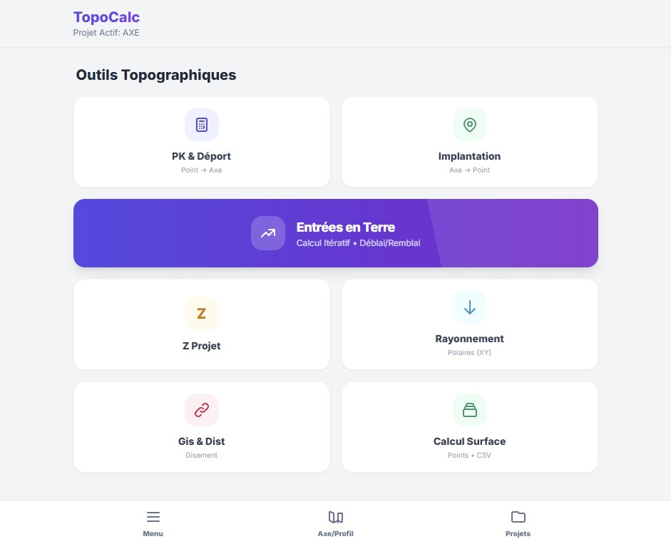
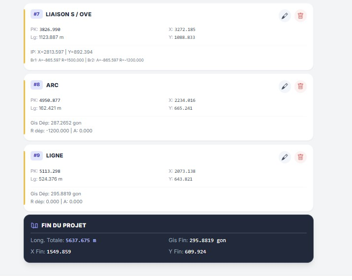
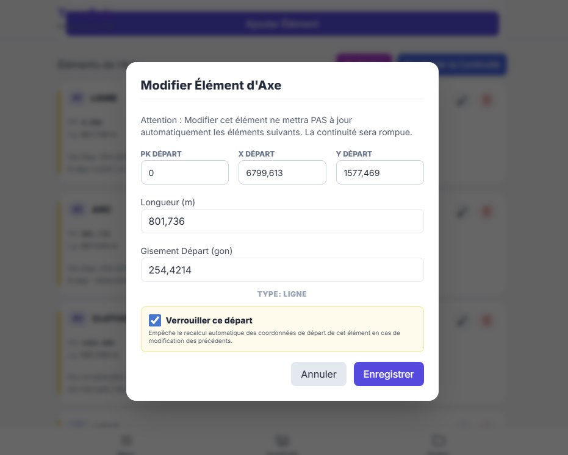
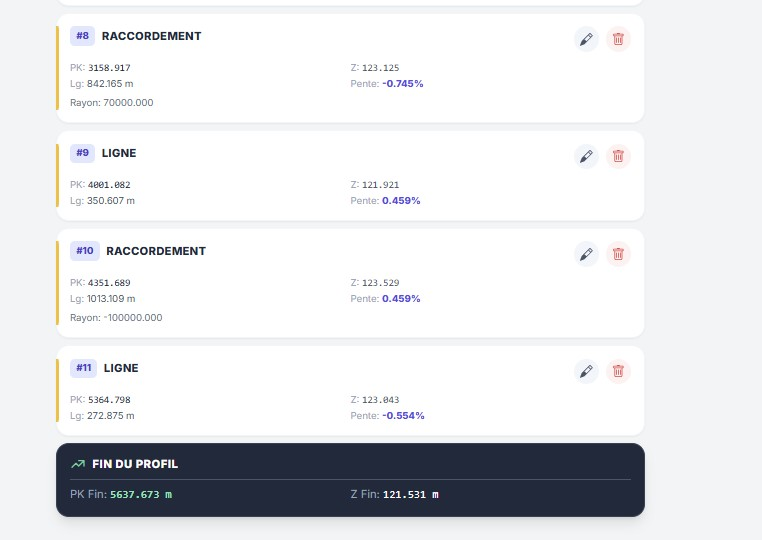
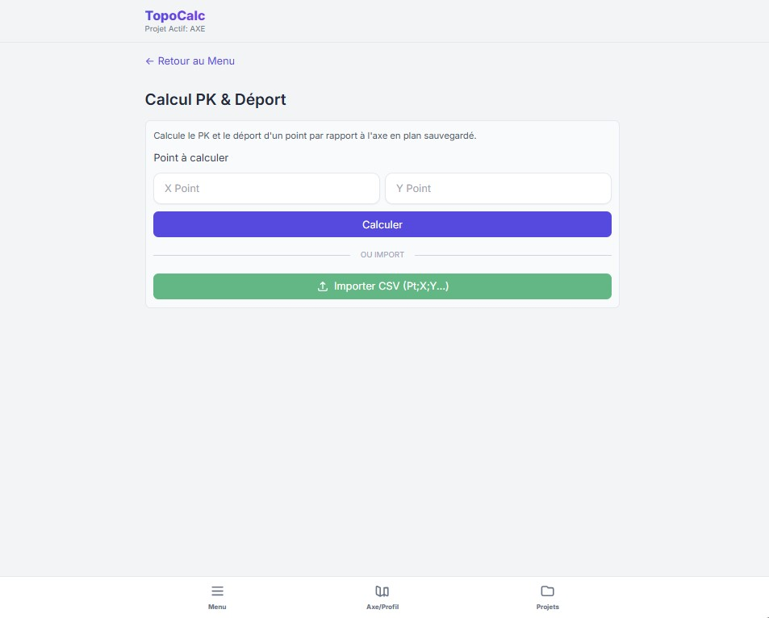
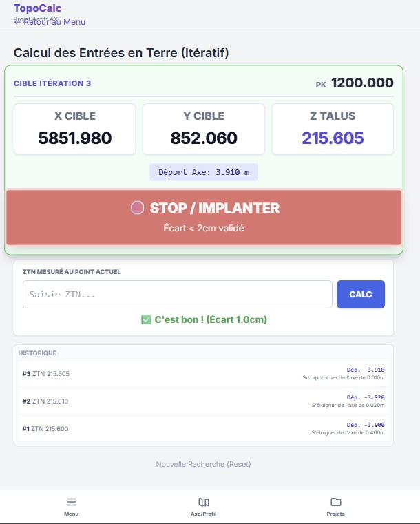
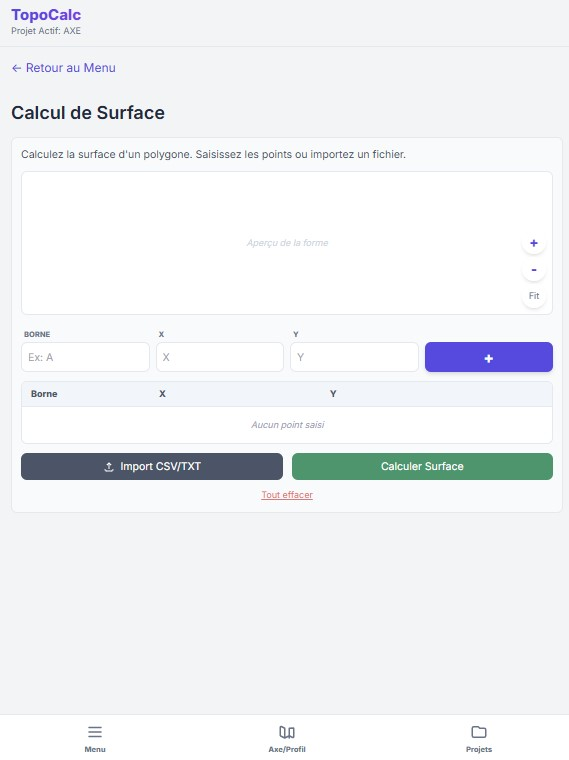

# 🏔️ TopoCalc - Distributeur Public

  
   
  <b>Developed By ABOUZID ABDELLATIF, CSE</b>

**TopoCalc** est une application professionnelle de calcul topographique (Progressive Web App et Android) développée pour assister les géomètres, topographes et projeteurs dans la conception, le calcul et l'implantation géométrique. 

Ce dépôt est destiné à la distribution publique de l'application et de ses manuels.

---

## 📸 Aperçu & Fonctionnalités Principales

TopoCalc propose une suite complète d'outils géométriques embarqués dont vous pourrez vous servir sur le terrain comme au bureau.

### 📱 Interface et Menu d'Accueil
L'application propose des tuiles dynamiques pour accéder instantanément aux fonctionnalités.

  

### 🛣️ Les Axes en Plan (Détails et implantation)
Gérez vos éléments de route horizontaux (Droites, Arcs, Clothoïdes) avec la génération du tracé graphique instantané et calcul complet d'éléments.

  
  

### 📈 Les Profils en Long
Bénéficiez d'un outil intuitif de calcul d'altimétries avec raccordements paraboliques pour évaluer vos pentes et rampes. L'interface affiche le dessin direct de votre parabole, de la corde et l'intersection des tangentes.

  
  

### 📐 Outils de calcul rapides (EET, PK/Déport, Surfaces)
Un ensemble de sous-logiciels utilitaires permettant le rayonnement rapide, calcul d'intersections, l'évaluation de PK (Points kilométriques) ou les calculs d'implantations polaires / rectangulaires.

  
  
  

---

## 📦 Contenu Téléchargeable
- `TOPO_CALC_Release_V01.apk` : L'application Android prête à s'installer.
- `MANUEL_UTILISATEUR.pdf` / `.html` : Le guide exhaustif du calcul mathématique et l'usage.
- `donnees_exemple/` : Exemples de fichiers pour l'import / test :
  - Sauvegardes de projets `.json`
  - Matrices Excel `.xlsx`
  - Fichiers d'exemples pour tester l'application `.csv`

---

## 🛠️ Instructions d'Installation (Android)
1. Téléchargez le fichier **`TOPO_CALC_Release_V01.apk`** depuis ce dépôt (cliquez dessus, puis sur le bouton Télécharger).
2. Ouvrez ce fichier APK sur votre appareil Android.
3. Si votre téléphone le demande, **"Autorisez l'installation d'applications issues de sources inconnues"** dans les paramètres.
4. Finalisez l'installation et lancez TopoCalc !

---

## 🍏 Instructions d'Installation pour iPhone / iPad (iOS)
Grâce au format Web App (PWA), TopoCalc est directement installable sur vos appareils Apple sans passer par l'App Store.

1. Ouvrez **Safari** sur votre iPhone ou iPad.
2. Allez sur le lien web officiel de l'application : **[https://topocalc.netlify.app/](https://topocalc.netlify.app/)**
3. Touchez l'icône de **Partage** en bas de l'écran (le petit carré avec une flèche pointant vers le haut).
4. Faites défiler le menu et sélectionnez **"Sur l'écran d'accueil"** (Add to Home Screen).
5. Appuyez sur **Ajouter** en haut à droite.

L'icône TopoCalc apparaîtra alors parmi vos applications et s'ouvrira en plein écran, comme une vraie application !

---
*Réalisé pour répondre aux besoins et exigences de la profession topographique.*
